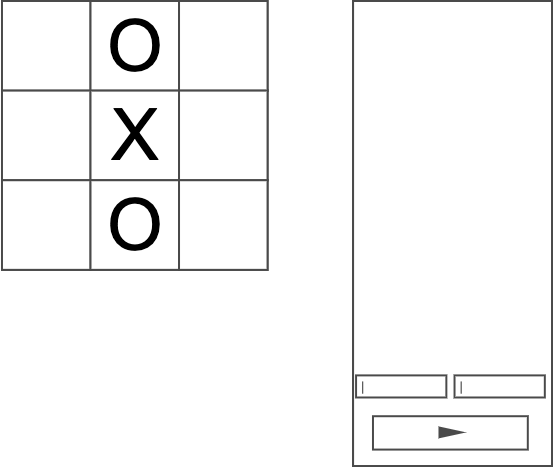
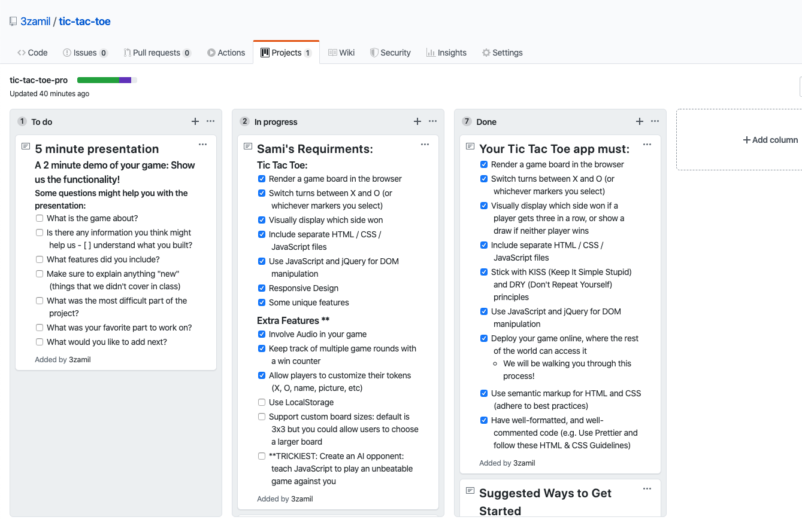

<!--  -->
<!--  -->


<!--  -->

# Project Tec Tac Toe

Tec Tac Toe is a famous game that two players can compete to make a line of Xs or Os before the other player.

I made it here to be played online instead of on paper. So it will be easier to track the game flow and determain the winner and make multible rounds of the game.

## My Project Deployment

I used Github pages to deploy this project. It can be accessed on [Tic Tac Toe](https://3zamil.github.io/tic-tac-toe/)

## Technologies used in the project
I used the most recent web technologies to build this game including:
- HTML5
- CSS
- JavaScript
- Audio
- Web free tools for graphic design
- Jquery
- Responsive Design

## wireframes and user stories.
I used wireframe website called [Cacoo](https://cacoo.com/). 
## Planning and Development Process
First I created a new project under Github project tools. Then I used Knaban methodology to manage my project's tasks. I used three columns to track tasks:
- To Do
- In Progress
- Done 


## Describe any lines or function in the code
This function takes ona parameter (winner) index and moves their names one step up. If number of rounds reach the max, the function wait for 3 seconds then reset names to starting position.
```js
const results = function(winner) {
  // when one player win
  $(".name-" + winner).animate({ bottom: "+=20%" }, "slow");
  if (round == 0) {
    ss = setTimeout(function() {
      $(".name-0").animate({ bottom: "-29px" }, "slow");
      $(".name-1").animate({ bottom: "-29px" }, "slow");
    }, 3000);
    round = 3;
    // let myVar = setTimeout(alertFunc, 3000);
  } else {
    round--;
  }
};
```
## Challenges
- Responsive design
- Virtical alignment
- Game logic
## Unsolved problems which would be fixed in future iterations.
- [ ] Rounds counter to allow users chose how many rounds they want toplay.
- [ ] Using local storage to save curent users data
- [ ] Inhance user experiance 
